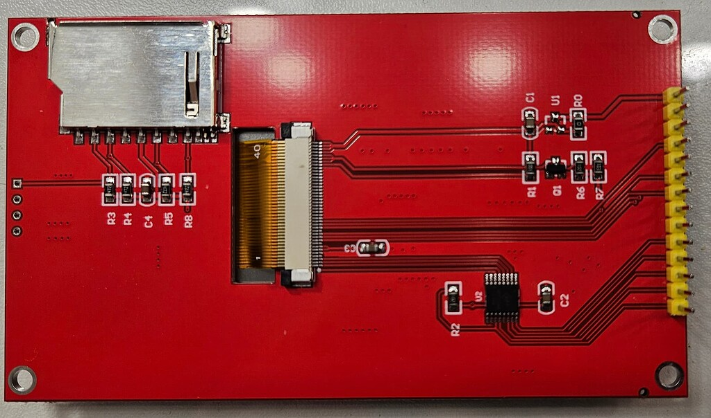
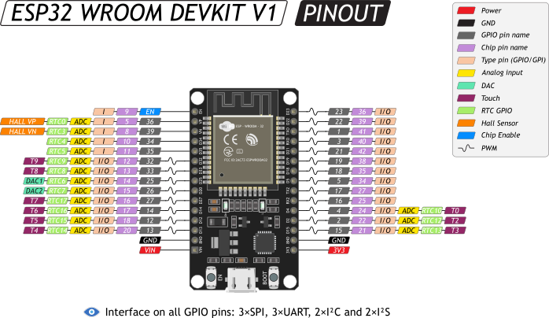

# NXT_Display

PlatformIO project for an ESP32 used as a smart display controller for an SPI ILI9488 screen.

The idea is similar to Nextion HMI modules: the main device sends short commands over a data line, and the ESP32 draws GUI elements locally. This keeps the external protocol compact while buttons, windows, scroll bars, labels, and other widgets are rendered by the ESP32.

## Hardware

### Display module



Common red 4.0 inch SPI ILI9488 board with resistive touch. The module also has a microSD socket, but this project does not use it yet.

### ESP32 board



Target board: ESP32 DevKit v1 / `esp32dev`.

## Default wiring

### ILI9488 display

This pinout is for the common red 4.0 inch ILI9488 SPI board with resistive touch.

| Board label | ESP32 pin |
| --- | --- |
| CS | GPIO5 |
| RST | GPIO4 |
| D/C | GPIO21 |
| SDI | GPIO23 |
| SCK | GPIO18 |
| BL | GPIO32 |
| SDO | leave disconnected |
| VDD | 3.3V |
| GND | GND |

If your display uses other pins, edit `include/User_Setup.h`.

GPIO2 is reserved for the onboard blue heartbeat LED on ESP32 DevKit v1.

### Resistive touch

| Board label | ESP32 pin |
| --- | --- |
| TCK | GPIO18 |
| TCS | GPIO22 |
| TDI | GPIO23 |
| TDO | GPIO19 |
| PEN | GPIO34 |

The display `SDO` pin can block the shared MISO line on this red board. Leave display `SDO` disconnected and connect only touch `TDO` to `GPIO19`.

The onboard microSD socket on the display module is not used yet. Leave the SD pins disconnected for the first display and touch bring-up.

### GUI command UART

| Signal | ESP32 pin |
| --- | --- |
| UART2 RX | GPIO16 |
| UART2 TX | GPIO17 |
| GND | GND |

Default baud rate: `115200`.

USB Serial also accepts the same commands, which is convenient for testing from the PlatformIO monitor.

## Command protocol

Each command is one text line ending with `\n`. Fields are separated by `|`.

Colors are RGB565 values. You can send decimal values or hex values such as `0x001F`.

| Command | Meaning |
| --- | --- |
| `CL|color` | Clear screen |
| `BT|id|x|y|w|h|label|fill|outline|text` | Draw button |
| `TW|id|x|y|w|h|title|text|fill|outline` | Draw text window |
| `SB|id|x|y|w|h|H/V|value|max|track|thumb` | Draw scroll bar |
| `TX|id|x|y|text|color|background|font` | Draw text label |
| `BM|id|x|y|name|foreground|background|scale` | Draw built-in bitmap |
| `BL|1` / `BL|0` | Backlight on/off |
| `IV|1` / `IV|0` | Display inversion on/off |

The older one-letter commands `C`, `B`, `W`, `S`, `T`, `L`, and `I` are still accepted for compatibility.

Built-in bitmap names:

| Name | Meaning |
| --- | --- |
| `play` | Play icon |
| `stop` | Stop icon |
| `wifi` | Wi-Fi icon |

Use background color `0x0001` to keep bitmap background transparent.

Examples:

```text
CL|0x0000
BT|1|40|80|120|42|START|0x0400|0x07E0|0xFFFF
TW|1|20|150|280|120|Status|System ready|0x4208|0x001F
SB|1|300|150|12|120|V|50|100|0x0000|0x07FF
TX|1|30|300|Hello ESP32|0xFFE0|0x0000|4
BM|1|30|30|wifi|0x07FF|0x0001|2
```

## Build and upload

```powershell
C:\Users\basachka\.platformio\penv\Scripts\pio.exe run
C:\Users\basachka\.platformio\penv\Scripts\pio.exe run -t upload
```
